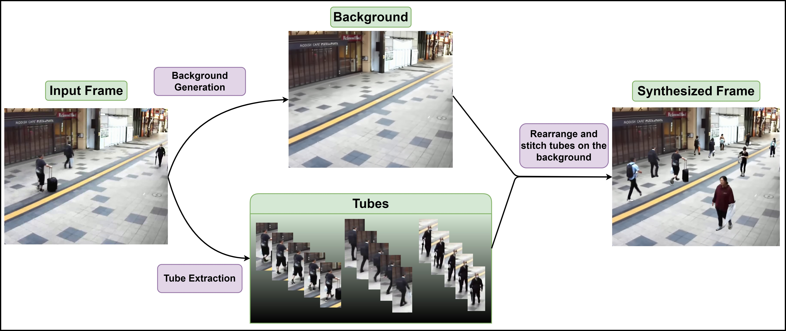

# Video Synopsis: FGS Model

Video synopsis is a powerful technique for condensing long surveillance videos into a shorter summary, where key activities are preserved. The process involves detecting and tracking objects in a video, followed by creating "object tubes"—sequences of frames that encapsulate the movement of a particular object over time. These object tubes are then rearranged to maximize the visibility of non-overlapping objects in each frame, resulting in a condensed version of the original video. This technique is particularly useful for applications such as security surveillance, where reviewing hours of footage quickly is crucial.



This work is introduce a video synopsis model called FGS. Full details are available at https://arxiv.org

## SynoClip Dataset
The **SynoClip** dataset is a comprehensive and standard dataset specifically designed for the video synopsis task. It consists of six videos, each ranging from 8 to 45 minutes in length, captured from outdoor-mounted surveillance cameras. This dataset is annotated with tracking information, making it an ideal resource not only for video synopsis but also for related tasks such as object detection in videos and multi-object tracking.

### Key Features:
- **Outdoor Surveillance Footage**: Captured from outdoor-mounted cameras, the dataset reflects real-world surveillance conditions.
- **Tracking Annotations**: Each video comes with detailed tracking annotations, enabling a fair comparison of video synopsis model performance.
- **Multi-Purpose Utility**: While primarily intended for video synopsis, the dataset can also be used for training and evaluating object detection and tracking models in videos.

### Download the Dataset
You can download the SynoClip dataset from the following Google Drive link:

[Download SynoClip Dataset](#your-google-drive-link-here)

## Using the Code

This project utilizes the YOLOv8n model from Ultralytics for object detection. To run the code, you need to execute `main.py` with the required arguments.
To run the video synopsis model, use the following command:

```bash
python3 main.py --InPath path/to/input/video/input.mp4 
               --IDPath path/to/save/directory/ 
               --Model path/to/yolo/weight/best.pt
```
To facilitate running the code, we provide a Google Colab notebook. You can access it via the link below:  

<a href="https://colab.research.google.com/github/Ramtin-ma/VideoSynopsis-FGS/blob/main/FGS.ipynb"></a>  

## Fine-Tuned YOLOv8n Model  

We have fine-tuned the YOLOv8n model using the SynoClip dataset. The best model weights, labeled as `best.pt`, are included in this repository. To utilize these weights, specify the `--Model` argument in your command.


